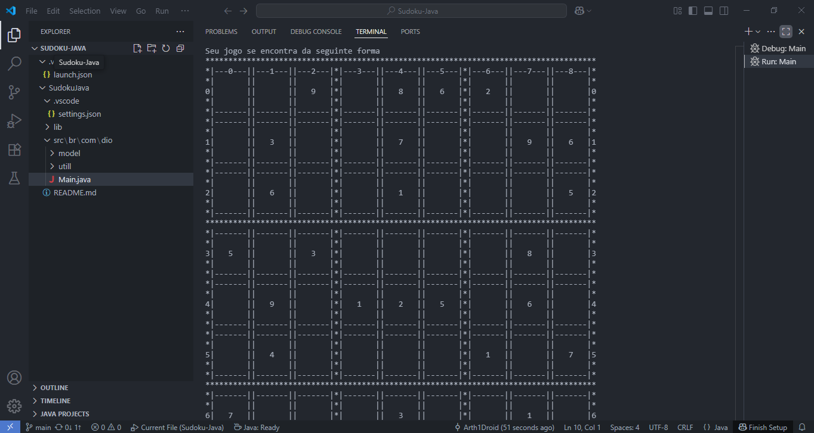
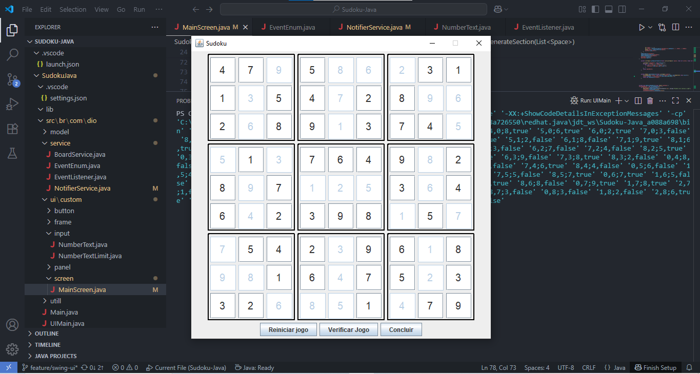

# 🧩Projeto Sudoku em Java (Terminal + Interface Gráfica)
Este repositório contém a implementação do clássico jogo **Sudoku** em **Java**, desenvolvido com foco em boas práticas de **Programação Orientada a Objetos (POO)**. O projeto tem duas versões:

- ✅ Versão Terminal (`main`)
- 🪟 Versão com Interface Gráfica utilizando **Java Swing** (`feature/swing-ui`)


## 📸 Capturas de Tela


### 🖥️ Versão Terminal



---

### 🎨 Versão com Interface Gráfica (Swing)



---## 🚀 Funcionalidades

### ✅ Versão Terminal (`main`)
- Execução no terminal
- Input via teclado
- Validação das jogadas
- Geração de tabuleiros válidos
- Detecção de vitória e mensagens de erro
- Reinício do jogo

### 🪟 Versão Swing (`feature/swing-ui`)
- Interface visual com Java Swing
- Tabuleiro interativo
- Input numérico por clique
- Validação visual de erros
- Feedback visual ao resolver o puzzle

---

## 🛠️ Tecnologias Utilizadas

- Java 17+
- Java Swing (GUI)
- Paradigma Orientado a Objetos
- Git & GitHub

---
## 🌱 Aprendizados

Durante o desenvolvimento deste projeto, aprimorei meus conhecimentos em:

- Estruturação de código com POO
- Separação entre lógica e interface (MVC)
- Criação de GUIs com eventos em Java
- Controle de versão com Git (uso de branches)

---## 📂 Como Executar

### Pré-requisitos
- Java JDK 17 ou superior
- IDE de sua preferência (VS Code, IntelliJ, Eclipse, etc.)

---

### ▶️ Rodando o código
```bash
Versão Terminal:

git checkout main
javac Main.java
java Main

---
Versão JavaSwing:

git checkout feature/swing-ui
javac UIMain.java
java UIMain

## Autores

- [@Arth1Droid](https://www.github.com/Arth1Droid)

👨‍💻 Autor
Arthur Barbosa Barros
Estudante de desenvolvimento Back-end (Java & Python)

[🔗 LinkedIn](https://www.linkedin.com/in/arthur-barros-387099213)
[🐙 GitHub](https://github.com/Arth1Droid)
